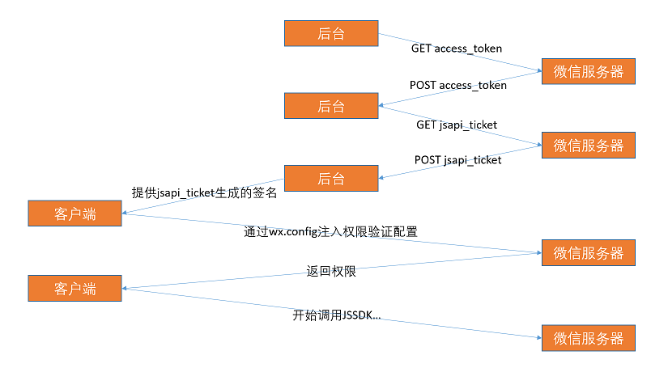

[English version](README_en.md)

本教程将覆盖了基本的在使用[微信JSSDK](https://mp.weixin.qq.com/wiki/7/aaa137b55fb2e0456bf8dd9148dd613f.html)的网页上运用TypeScript的例子。

# 开始之前

1. 安装[node.js](https://nodejs.org/en/download/)。

1. 拥有/申请网页将使用的域名以及能够使用Node.js的服务器。可参照[Create a Node.js Application on Web App](https://docs.microsoft.com/en-us/azure/app-service-web/app-service-web-get-started-nodejs)文档使用Azure。

2. 完成微信开发文档[步骤一：绑定域名](https://mp.weixin.qq.com/wiki/7/aaa137b55fb2e0456bf8dd9148dd613f.html#.E6.AD.A5.E9.AA.A4.E4.B8.80.EF.BC.9A.E7.BB.91.E5.AE.9A.E5.9F.9F.E5.90.8D)。如果没有自己的公众号，可注册并使用微信[测试号](https://mp.weixin.qq.com/debug/cgi-bin/sandbox?t=sandbox/login)。记录下自己的appId, appsecret以及将使用的host URL。

# 搭建node.js/express后台

## 初始

建立一个新的npm package,

```
mkdir wxapp
cd wxapp
npm init
```

在生成的`package.json`的`scripts`中添加以下scripts,

```
"scripts": {
    "start": "node index.js",
    "build-ts": "node ./node_modules/typescript/bin/tsc"
},
```  

安装需要的packages（express, ejs, request以及sha1）,

```
npm install --save express ejs request sha1
```

安装TypeScript以及之前安装的packages的类型定义。

```
npm install --save-dev typescript @types/node @types/express @types/request @types/sha1
```

由于暂时[DefinitelyTyped](https://github.com/DefinitelyTyped/DefinitelyTyped)中并没有JSSDK相关的类型定义文件(.d.ts)，请将本项目中的`types`文件夹（包含类型定义文件[wechat.d.ts](types/wechat.d.ts)）复制到根目录（`wxapp`）中以便TypeScript获取JSSDK的类型定义。

## 配置TypeScript

在`wxapp`根目录下添加TypeScript配置文件`tsconfig.json`，

```js
{
  "compilerOptions": {
    "target": "es6",                          /* Specify ECMAScript target version: 'ES3' (default), 'ES5', 'ES2015', 'ES2016', 'ES2017', or 'ESNEXT'. */
    "module": "commonjs",                     /* Specify module code generation: 'commonjs', 'amd', 'system', 'umd' or 'es2015'. */
    "moduleResolution": "node"                /* Specify module resolution strategy: 'node' (Node.js) or 'classic' (TypeScript pre-1.6). */
  }
}
```

可以根据项目的需求自行添加[其他编译选项](https://www.typescriptlang.org/docs/handbook/compiler-options.html)，比如`strict`。

## 获取jsapi_ticket

对应[通过config接口注入权限验证配置](https://mp.weixin.qq.com/wiki/7/aaa137b55fb2e0456bf8dd9148dd613f.html#.E6.AD.A5.E9.AA.A4.E4.B8.89.EF.BC.9A.E9.80.9A.E8.BF.87config.E6.8E.A5.E5.8F.A3.E6.B3.A8.E5.85.A5.E6.9D.83.E9.99.90.E9.AA.8C.E8.AF.81.E9.85.8D.E7.BD.AE)文档，调用微信JSSDK需要在自己的服务器后台向微信服务器获取jsapi_ticket并在前端通过`wx.config`进行验证。大致实现流程，

<p align="center">
    
</p>

在根目录添加后台的初始文件`index.ts`，

```ts
import * as express from "express";
import * as request from "request";
import sha1 = require("sha1");

let app = express(); 

// Insert metadata
let appId = '';             // Insert your appId
let appsecret = '';         // insert your appsecret
let url = '';               // insert host url, e.g. http://wxapp.azurewebsites.net/
let nonceStr = '';          // insert any string

// define an interface containing params for wx.config
interface configObj {
    appId: string,
    timestamp: string,
    nonceStr: string,
    signature: string
}

// handshake with WeChat server and get signature for wx.config
function getWXConfig(cb) {
    request.get('https://api.weixin.qq.com/cgi-bin/token?grant_type=client_credential&appid='+appId+'&secret='+appsecret, (err, res, body) => {
        request.get('https://api.weixin.qq.com/cgi-bin/ticket/getticket?access_token='+JSON.parse(body).access_token+'&type=jsapi', (err, res, body) => {
            let ticket = JSON.parse(body).ticket;
            let o: configObj = {
                appId: appId,
                nonceStr: nonceStr, 
                timestamp: new Date().getTime() / 1000 + '',
                signature: ''
            };
            o.signature = sha1('jsapi_ticket='+ticket+'&noncestr='+o.nonceStr+'&timestamp='+o.timestamp+'&url='+url).toString();
            cb(o);
        });
    });
}

app.engine('.html', require('ejs').__express);          // set up ejs as view engine
app.set('views', __dirname + '/views');                 // set views dir
app.set('view engine', 'html');                         // use .html for ejs files
app.use(express.static('public'))                       // expose assets in /public
app.get('/', function (req, res) {
    getWXConfig(config => {
        // handshake with WeChat server and render index.html with the returned signature
        res.render('index', {
            appId: config.appId,
            timestamp: config.timestamp,
            nonceStr: config.nonceStr,
            signature: config.signature,
        });
    })
});
app.listen(8080);

```

在`index.ts`中修改并填入自己的appId等等参数，
```ts
// Insert metadata
let appId = '';                     // Insert your appId
let appsecret = '';                 // insert your appsecret
let url = '';                       // insert host url, e.g. http://wxapp.azurewebsites.net/
let nonceStr = 'hellotypescript';   // insert any string
```

建立的node.js+express后台会通过`getWXConfig`向微信服务器[获取jsapi_ticket](https://mp.weixin.qq.com/wiki/7/aaa137b55fb2e0456bf8dd9148dd613f.html#.E8.8E.B7.E5.8F.96api_ticket)，并将[wx.config](https://mp.weixin.qq.com/wiki/7/aaa137b55fb2e0456bf8dd9148dd613f.html#.E6.AD.A5.E9.AA.A4.E4.B8.89.EF.BC.9A.E9.80.9A.E8.BF.87config.E6.8E.A5.E5.8F.A3.E6.B3.A8.E5.85.A5.E6.9D.83.E9.99.90.E9.AA.8C.E8.AF.81.E9.85.8D.E7.BD.AE)所需的参数通过ejs渲染(`res.render(...)`)至客户端页面。

在`index.ts`中已定义将后台推至客户端的文件放入`/views`（包含所有需要ejs渲染的`html`文件）以及`/public`（其余的文件）文件夹。之后的步骤将覆盖前端的页面。
``` ts
app.set('views', __dirname + '/views');                 // set views dir
app.use(express.static('public'))                       // expose assets in /public
```

# 客户端页面

## index.html

在根目录下建立`views`文件夹并在其中添加`index.html`（推至客户端的主页），

```html
<!DOCTYPE html>
<html lang="en">
<head>
    <meta charset="utf-8">
    <title> WeChat TypeScript sample </title>
</head>
<body>
<script type="text/javascript" src="http://res.wx.qq.com/open/js/jweixin-1.0.0.js"></script>
<script type="text/javascript">
    wx.config({
        debug: false,
        appId: '<%=appId%>',
        timestamp: '<%=timestamp%>',
        nonceStr: '<%=nonceStr%>',
        signature: '<%=signature%>',
        jsApiList: [
            'checkJsApi',
            'onMenuShareTimeline',
            'onMenuShareAppMessage',
            'onMenuShareQQ',
            'onMenuShareWeibo',
            'onMenuShareQZone',
            'hideMenuItems',
            'showMenuItems',
            'hideAllNonBaseMenuItem',
            'showAllNonBaseMenuItem',
            'translateVoice',
            'startRecord',
            'stopRecord',
            'onVoiceRecordEnd',
            'playVoice',
            'onVoicePlayEnd',
            'pauseVoice',
            'stopVoice',
            'uploadVoice',
            'downloadVoice',
            'chooseImage',
            'previewImage',
            'uploadImage',
            'downloadImage',
            'getNetworkType',
            'openLocation',
            'getLocation',
            'hideOptionMenu',
            'showOptionMenu',
            'closeWindow',
            'scanQRCode',
            'chooseWXPay',
            'openProductSpecificView',
            'addCard',
            'chooseCard',
            'openCard'
        ]
    });
</script>
<script type="text/javascript" src="/js/demo.js"></script>
</body>
</html>
```

`index.html`中引入了微信JSSDK（`http://res.wx.qq.com/open/js/jweixin-1.0.0.js`）以及将在客户端实现的简单的demo（`/js/demo.js`）。嵌入的JavaScript包含了之前渲染的`getWXConfig`提供的讯息并通过`wx.config`注入权限验证配置。

## demo.ts

在根目录下建立`public/js`文件夹，并在其中添加`demo.ts`,

```ts
wx.ready(() => {
    // open specifc location on map
    wx.openLocation({
        latitude: 0,
        longitude: 0,
        name: '',
        address: '',
        scale: 1,
        infoUrl: ''
    });
})

wx.error((err) => alert(err));
```

在这个简化的例子中，我们仅使用`wx.openLocation`打开地图，但在`demo.ts`中你可以尝试使用任何在`JsApiList`中申请的API。

# 生成与部署

将`.ts`文件编译成`.js`，

```
npm run build-ts
```

部署至服务器。

将页面所在的网址转换成二维码，打开微信扫一扫便可看到成果。

<p align="center">
    
</p>
