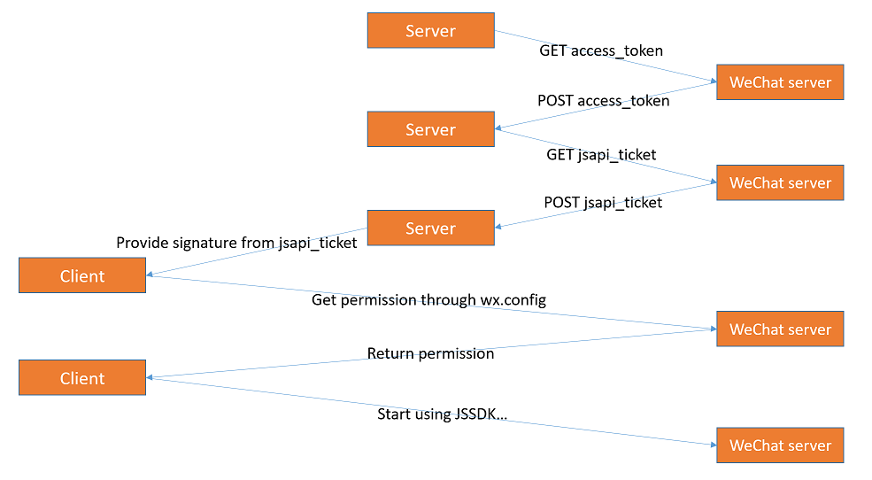
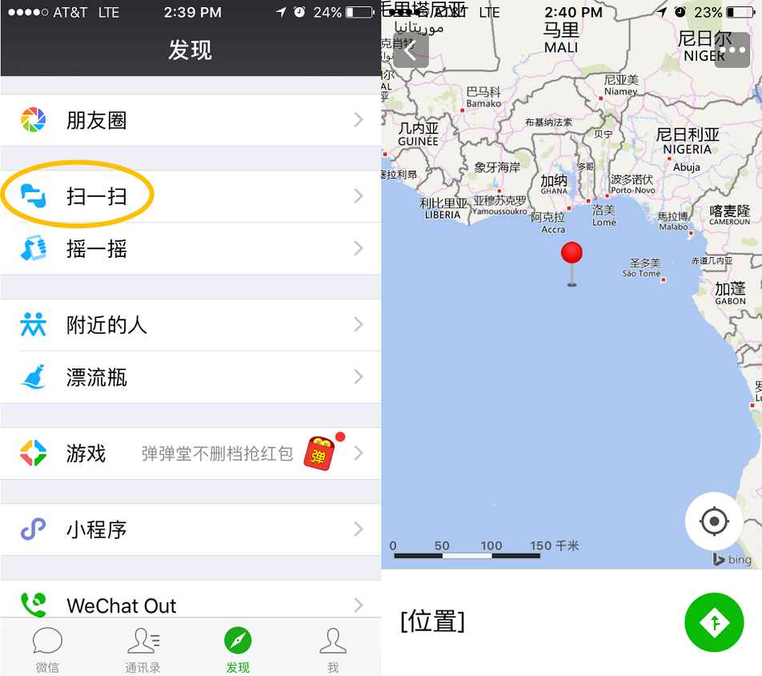

[中文版](README.md) (Chinese Version of this walkthrough)

This tutorial covers a basic sample using [WeChat JSSDK](https://mp.weixin.qq.com/wiki/7/aaa137b55fb2e0456bf8dd9148dd613f.html) and TypeScript together.

# Before you start

1. Install [node.js](https://nodejs.org/en/download/).

1. Get your own domain and node.js server. See [Create a Node.js Application on Web App](https://docs.microsoft.com/en-us/azure/app-service-web/app-service-web-get-started-nodejs) for using Azure.

2. Finish [step 1 - binding domain name](https://mp.weixin.qq.com/wiki/7/aaa137b55fb2e0456bf8dd9148dd613f.html#.E6.AD.A5.E9.AA.A4.E4.B8.80.EF.BC.9A.E7.BB.91.E5.AE.9A.E5.9F.9F.E5.90.8D). If you don't have an official WeChat account, you can apply for a [test account](https://mp.weixin.qq.com/debug/cgi-bin/sandbox?t=sandbox/login). Keep your appId, appsecret and host URL at hand.

# Set up node.js/express

## Initial steps

Create a new package,

```
mkdir wxapp
cd wxapp
npm init
```

In `scripts` in `package.json`, add,

```
"scripts": {
    "start": "node index.js",
    "build-ts": "node ./node_modules/typescript/bin/tsc"
},
```  

Install dependencies (express, ejs, request, and sha1),

```
npm install --save express ejs request sha1
```

Install TypeScript and type definition files for installed packages,

```
npm install --save-dev typescript @types/node @types/express @types/request @types/sha1
```

Since [DefinitelyTyped](https://github.com/DefinitelyTyped/DefinitelyTyped) does not have type definitions for WeChat JSSDK at the mement , copy the `types` folder containing [wechat.d.ts](/types/wechat.d.ts) to the project root folder (`wxapp`).

## Configure TypeScript

Add TypeScript configuration file `tsconfig.json` under the project root folder,

```js
{
  "compilerOptions": {
    "target": "es6",                          /* Specify ECMAScript target version: 'ES3' (default), 'ES5', 'ES2015', 'ES2016', 'ES2017', or 'ESNEXT'. */
    "module": "commonjs",                     /* Specify module code generation: 'commonjs', 'amd', 'system', 'umd' or 'es2015'. */
    "moduleResolution": "node"                /* Specify module resolution strategy: 'node' (Node.js) or 'classic' (TypeScript pre-1.6). */
  }
}
```

You can add [other compiler flags](https://www.typescriptlang.org/docs/handbook/compiler-options.html) (e.g. `strict`) based on your own need.

## Get jsapi_ticket

According to [WeChat documentation](https://mp.weixin.qq.com/wiki/7/aaa137b55fb2e0456bf8dd9148dd613f.html#.E6.AD.A5.E9.AA.A4.E4.B8.89.EF.BC.9A.E9.80.9A.E8.BF.87config.E6.8E.A5.E5.8F.A3.E6.B3.A8.E5.85.A5.E6.9D.83.E9.99.90.E9.AA.8C.E8.AF.81.E9.85.8D.E7.BD.AE), using WeChat JSSDK requires getting jsapi_ticket from WeChat server on our server side and then using `wx.config` to get API permission on the cliend side. A rough flow looks like below,

<p align="center">
    
</p>

Add `index.ts` in the root folder,

```ts
import * as express from "express";
import * as request from "request";
import sha1 = require("sha1");

let app = express(); 

// Insert metadata
let appId = '';             // Insert your appId
let appsecret = '';         // insert your appsecret
let url = '';               // insert host url, e.g. http://wxapp.azurewebsites.net/
let nonceStr = '';          // insert any string

// define an interface containing params for wx.config
interface configObj {
    appId: string,
    timestamp: string,
    nonceStr: string,
    signature: string
}

// handshake with WeChat server and get signature for wx.config
function getWXConfig(cb) {
    request.get('https://api.weixin.qq.com/cgi-bin/token?grant_type=client_credential&appid='+appId+'&secret='+appsecret, (err, res, body) => {
        request.get('https://api.weixin.qq.com/cgi-bin/ticket/getticket?access_token='+JSON.parse(body).access_token+'&type=jsapi', (err, res, body) => {
            let ticket = JSON.parse(body).ticket;
            let o: configObj = {
                appId: appId,
                nonceStr: nonceStr, 
                timestamp: new Date().getTime() / 1000 + '',
                signature: ''
            };
            o.signature = sha1('jsapi_ticket='+ticket+'&noncestr='+o.nonceStr+'&timestamp='+o.timestamp+'&url='+url).toString();
            cb(o);
        });
    });
}

app.engine('.html', require('ejs').__express);          // set up ejs as view engine
app.set('views', __dirname + '/views');                 // set views dir
app.set('view engine', 'html');                         // use .html for ejs files
app.use(express.static('public'))                       // expose assets in /public
app.get('/', function (req, res) {
    getWXConfig(config => {
        // handshake with WeChat server and render index.html with the returned signature
        res.render('index', {
            appId: config.appId,
            timestamp: config.timestamp,
            nonceStr: config.nonceStr,
            signature: config.signature,
        });
    })
});
app.listen(8080);

```

Fill in your appId and other metadata in `index.ts`,

```ts
// Insert metadata
let appId = '';                     // Insert your appId
let appsecret = '';                 // insert your appsecret
let url = '';                       // insert host url, e.g. http://wxapp.azurewebsites.net/
let nonceStr = 'hellotypescript';   // insert any string
```

Our server will [get jsapi_ticket](https://mp.weixin.qq.com/wiki/7/aaa137b55fb2e0456bf8dd9148dd613f.html#.E8.8E.B7.E5.8F.96api_ticket) from WeChat server through `getWXConfig`, and render the signature for [wx.config](https://mp.weixin.qq.com/wiki/7/aaa137b55fb2e0456bf8dd9148dd613f.html#.E6.AD.A5.E9.AA.A4.E4.B8.89.EF.BC.9A.E9.80.9A.E8.BF.87config.E6.8E.A5.E5.8F.A3.E6.B3.A8.E5.85.A5.E6.9D.83.E9.99.90.E9.AA.8C.E8.AF.81.E9.85.8D.E7.BD.AE) in client side html through ejs.

Within `index.ts`, we've defined our client side files to be stored in `/views` (`html` to be rendered by ejs) and `/public` (other files). The next step will cover client side pages.

``` ts
app.set('views', __dirname + '/views');                 // set views dir
app.use(express.static('public'))                       // expose assets in /public
```

# Client side pages

## index.html

Create `views` folder under the root folder and add `index.html`,

```html
<!DOCTYPE html>
<html lang="en">
<head>
    <meta charset="utf-8">
    <title> WeChat TypeScript sample </title>
</head>
<body>
<script type="text/javascript" src="http://res.wx.qq.com/open/js/jweixin-1.0.0.js"></script>
<script type="text/javascript">
    wx.config({
        debug: false,
        appId: '<%=appId%>',
        timestamp: '<%=timestamp%>',
        nonceStr: '<%=nonceStr%>',
        signature: '<%=signature%>',
        jsApiList: [
            'checkJsApi',
            'onMenuShareTimeline',
            'onMenuShareAppMessage',
            'onMenuShareQQ',
            'onMenuShareWeibo',
            'onMenuShareQZone',
            'hideMenuItems',
            'showMenuItems',
            'hideAllNonBaseMenuItem',
            'showAllNonBaseMenuItem',
            'translateVoice',
            'startRecord',
            'stopRecord',
            'onVoiceRecordEnd',
            'playVoice',
            'onVoicePlayEnd',
            'pauseVoice',
            'stopVoice',
            'uploadVoice',
            'downloadVoice',
            'chooseImage',
            'previewImage',
            'uploadImage',
            'downloadImage',
            'getNetworkType',
            'openLocation',
            'getLocation',
            'hideOptionMenu',
            'showOptionMenu',
            'closeWindow',
            'scanQRCode',
            'chooseWXPay',
            'openProductSpecificView',
            'addCard',
            'chooseCard',
            'openCard'
        ]
    });
</script>
<script type="text/javascript" src="/js/demo.js"></script>
</body>
</html>
```

`index.html` includes the JSSDK (`http://res.wx.qq.com/open/js/jweixin-1.0.0.js`) and a simple demo (`/js/demo.js`). The embedded JavaScript includes rendered signature from `getWXConfig` and uses `wx.config` to get API permission from WeChat.

## demo.ts

Create `public/js` folder under the root folder, and add `demo.ts`,

```ts
wx.ready(() => {
    // open specifc location on map
    wx.openLocation({
        latitude: 0,
        longitude: 0,
        name: '',
        address: '',
        scale: 1,
        infoUrl: ''
    });
})

wx.error((err) => alert(err));
```

In this simple demo, we only use `wx.openLocation` to open a map, but you can try calling any API from `JsApiList` in `demo.ts`.

# Build and deploy

Transpile `.ts` files to `.js`,

```
npm run build-ts
```

Deploy the project to server.

After deployment, translate your URL to QR code and open 微信扫一扫 to see the demo in action.

<p align="center">
    
</p>
